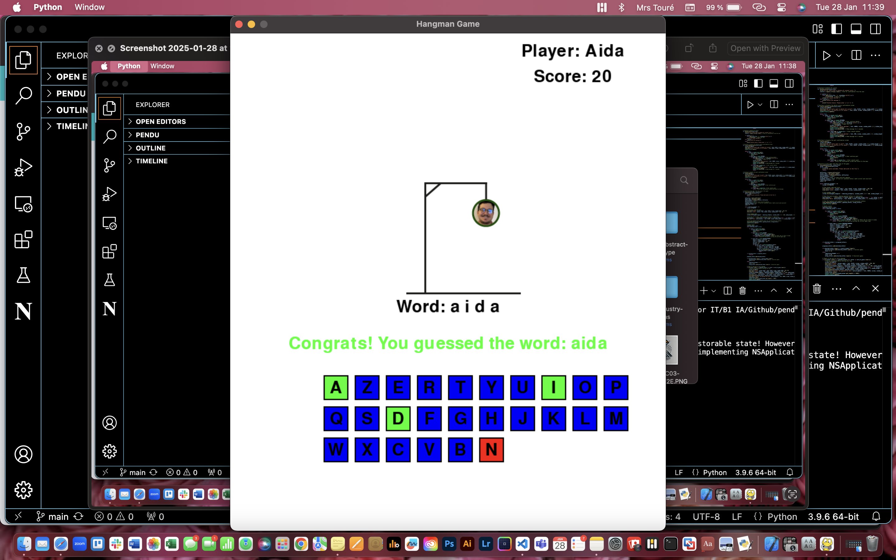

# Hangman game



## Project Description

This is a Hangman game developed in Python. It’s a classic word-guessing game where the player must guess a hidden word by suggesting letters. The player has a limited number of incorrect guesses (6) before losing the game. This project provides a fun and interactive way to test vocabulary and problem-solving skills.

## Demo

Playing the game: [Live Demo](https://www.youtube.com/watch?v=8V0z4-qxDac)

## 🎮 Features

- Word Guessing: Players must guess the hidden word one letter at a time.
- Add word : possibility to add a new word
- Limited Guesses (6): Players have six incorrect attempts before the game ends.
- Random Word Selection: Words are randomly chosen from a pre-defined list based on difficulty:
  - Easy: 4-letter words
  - Medium: 5 to 7-letter words
  - Difficult: 8 or more letters
- Score Tracking: Tracks the player's score based on successful and unsuccessful letters.
- Interactive Interface: A user-friendly interface for an engaging gameplay experience.

## Technologies and tools Used

- Python : The core programming language used to develop the game.
- Pygame : Library used to create the graphical user interface (GUI) and manage game interactions.
- Canva : Used for designing visual assets such as UI elements and game illustrations.

## Prerequisites

Before running this project, ensure you have the following installed:

- Python 3.x
- The following Python libraries:
  - `pygame`

## Installation Steps

1. Clone this repository:
   ```bash
   git clone https://github.com/aida-niang/pendu.git
   ```
2. Install dependencies:
   ```bash
   pip install pygame 
   ```

## Usage

Run the game with:
```bash
python3 hangman.py
```

## Project Structure

```
📂 Pendu
├── 📁 assets/            # Graphics and sound resources  
│   ├── 📁 images/        # Images for the Hangman UI and game elements  
│   ├── 📁 sounds/        # Sound effects (correct/incorrect guess, win, lose, background music)  
├── hangman.py            # Main game logic, handling player interactions and mechanics  
├── scores.txt            # Stores the scores of players based on their game performance  
├── words.txt             # Contains a list of words used for the game. 
├── .gitignore            # Excludes unnecessary files (e.g., temporary or local data)  
└── README.md             # Project documentation  


```

## Detailed File Descriptions
- hangman.py : Manages the game flow, player input, word selection, add word and win/loss conditions.
- scores.txt : Stores players' scores based on successful and unsuccessful letters.
- words.txt : Contains predefined word lists.
- assets/ : Contains all graphical and sound elements used in the game (images, sound effects).
- .gitignore : Specifies files to be ignored by version control.
- README.md : Provides documentation and instructions for the project.

## Contributing

This project was developed by:
- [Aida NIANG](https://github.com/aida-niang/)
- Amina TALEB
- Yannis MESSADIA

## License

This project is licensed under the MIT License - see the [LICENSE](LICENSE) file for details.

## Acknowledgments

Thanks to everyone who contributed to the development of this game!

## Built With

- Python 3.8

## Contact

**Aida NIANG** 
- I'm in : [LinkedIn](https://linkedin.com/in/aidabenhamathniang)
- Contact me : [Email](mailto:aidam.niang@gmail.com  )
- Project Link: [Portfolio](https://aida-niang.students-laplateforme.io)

